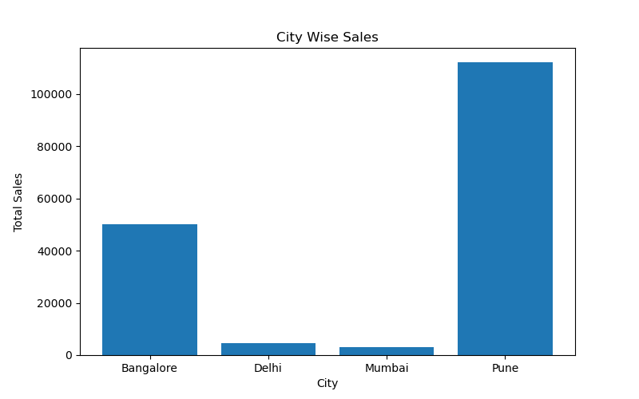
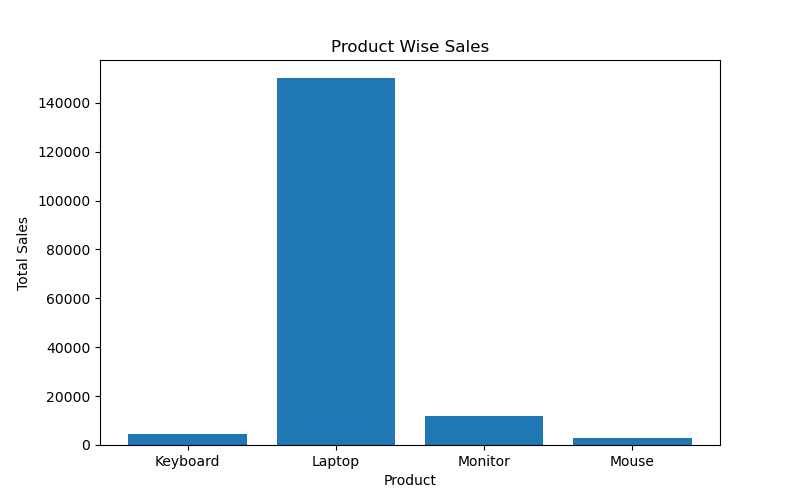
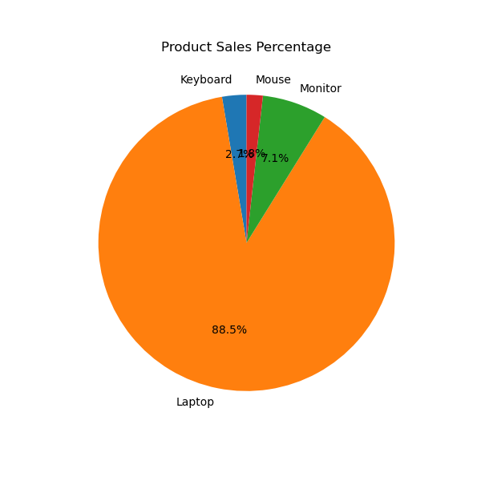

# 📊 Sales Analysis using Python

## 📌 Project Overview
This project analyzes sales data using Python and visualizes insights using charts.

## 🚀 Features
- City Wise Sales Analysis
- Product Wise Sales Analysis
- Product Sales Percentage
- Bar Charts
- Pie Chart

## 🛠️ Tools Used
- Python
- Pandas
- Matplotlib
- Jupyter Notebook

## 📂 Files Included
- Sales_Data_Analysis.ipynb
- sales_data.csv

## 📈 Project Preview

### City Wise Sales

### Product Wise Sales

### Product Sales Percentage

## 👨‍💻 Author
Rohan
